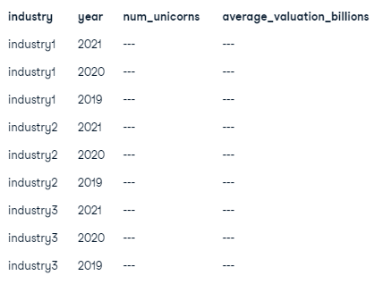

[Analyzing Unicorns Companies project](https://app.datacamp.com/learn/projects/1531) is a DataCamp unguided SQL project that intends to find the number of companies that achieved unicorn status (values exceeding USD 1 billion) between 2019 and 2021.


# Tables
Given is the `unicorns` database, which contains the following tables.

#### `dates` table

| Column       | Description                                  |
|------------- |--------------------------------------------- |
| company_id   | A unique ID for the company.                 |
| date_joined  | The date that the company became a unicorn.  |
| year_founded | The year that the company was founded.       |


```sql
SELECT * FROM dates
LIMIT 5;
```


<table border="1" class="dataframe">
  <thead>
    <tr style="text-align: right;">
      <th></th>
      <th>company_id</th>
      <th>date_joined</th>
      <th>year_founded</th>
    </tr>
  </thead>
  <tbody>
    <tr>
      <th>0</th>
      <td>189</td>
      <td>2017-06-24 00:00:00+00:00</td>
      <td>1919</td>
    </tr>
    <tr>
      <th>1</th>
      <td>848</td>
      <td>2021-06-01 00:00:00+00:00</td>
      <td>2019</td>
    </tr>
    <tr>
      <th>2</th>
      <td>556</td>
      <td>2022-02-15 00:00:00+00:00</td>
      <td>2011</td>
    </tr>
    <tr>
      <th>3</th>
      <td>999</td>
      <td>2021-11-17 00:00:00+00:00</td>
      <td>2020</td>
    </tr>
    <tr>
      <th>4</th>
      <td>396</td>
      <td>2021-10-21 00:00:00+00:00</td>
      <td>2021</td>
    </tr>
  </tbody>
</table>
</div>


#### `funding` table

| Column           | Description                                  |
|----------------- |--------------------------------------------- |
| company_id       | A unique ID for the company.                 |
| valuation        | Company value in US dollars.                 |
| funding          | The amount of funding raised in US dollars.  |
| select_investors | A list of key investors in the company.      |


```sql
SELECT * FROM funding
LIMIT 5;
```


<table border="1" class="dataframe">
  <thead>
    <tr style="text-align: right;">
      <th></th>
      <th>company_id</th>
      <th>valuation</th>
      <th>funding</th>
      <th>select_investors</th>
    </tr>
  </thead>
  <tbody>
    <tr>
      <th>0</th>
      <td>189</td>
      <td>4000000000</td>
      <td>0</td>
      <td>EQT Partners</td>
    </tr>
    <tr>
      <th>1</th>
      <td>848</td>
      <td>1000000000</td>
      <td>100000000</td>
      <td>Dragonfly Captial, Qiming Venture Partners, DS...</td>
    </tr>
    <tr>
      <th>2</th>
      <td>556</td>
      <td>2000000000</td>
      <td>100000000</td>
      <td>Blackstone, Bessemer Venture Partners</td>
    </tr>
    <tr>
      <th>3</th>
      <td>999</td>
      <td>1000000000</td>
      <td>100000000</td>
      <td>Goldman Sachs Asset Management, 3L</td>
    </tr>
    <tr>
      <th>4</th>
      <td>396</td>
      <td>2000000000</td>
      <td>100000000</td>
      <td>Insight Partners, Softbank Group, Connect Vent...</td>
    </tr>
  </tbody>
</table>
</div>


#### `industries` table
| Column       | Description                                  |
|------------- |--------------------------------------------- |
| company_id   | A unique ID for the company.                 |
| industry     | The industry that the company operates in.   |


```sql
SELECT * FROM industries
LIMIT 5;
```


<table border="1" class="dataframe">
  <thead>
    <tr style="text-align: right;">
      <th></th>
      <th>company_id</th>
      <th>industry</th>
    </tr>
  </thead>
  <tbody>
    <tr>
      <th>0</th>
      <td>189</td>
      <td>Health</td>
    </tr>
    <tr>
      <th>1</th>
      <td>848</td>
      <td>Fintech</td>
    </tr>
    <tr>
      <th>2</th>
      <td>556</td>
      <td>Internet software &amp; services</td>
    </tr>
    <tr>
      <th>3</th>
      <td>999</td>
      <td>Internet software &amp; services</td>
    </tr>
    <tr>
      <th>4</th>
      <td>396</td>
      <td>Fintech</td>
    </tr>
  </tbody>
</table>
</div>


#### `companies` table
| Column       | Description                                       |
|------------- |-------------------------------------------------- |
| company_id   | A unique ID for the company.                      |
| company      | The name of the company.                          |
| city         | The city where the company is headquartered.      |
| country      | The country where the company is headquartered.   |
| continent    | The continent where the company is headquartered. |


```sql
SELECT * FROM companies
LIMIT 5;
```


<table border="1" class="dataframe">
  <thead>
    <tr style="text-align: right;">
      <th></th>
      <th>company_id</th>
      <th>company</th>
      <th>city</th>
      <th>country</th>
      <th>continent</th>
    </tr>
  </thead>
  <tbody>
    <tr>
      <th>0</th>
      <td>189</td>
      <td>Otto Bock HealthCare</td>
      <td>Duderstadt</td>
      <td>Germany</td>
      <td>Europe</td>
    </tr>
    <tr>
      <th>1</th>
      <td>848</td>
      <td>Matrixport</td>
      <td></td>
      <td>Singapore</td>
      <td>Asia</td>
    </tr>
    <tr>
      <th>2</th>
      <td>556</td>
      <td>Cloudinary</td>
      <td>Santa Clara</td>
      <td>United States</td>
      <td>North America</td>
    </tr>
    <tr>
      <th>3</th>
      <td>999</td>
      <td>PLACE</td>
      <td>Bellingham</td>
      <td>United States</td>
      <td>North America</td>
    </tr>
    <tr>
      <th>4</th>
      <td>396</td>
      <td>candy.com</td>
      <td>New York</td>
      <td>United States</td>
      <td>North America</td>
    </tr>
  </tbody>
</table>
</div>


# Tasks
* Identify the three best-performing industries based on the number of new unicorns created over the last three years (2019, 2020, and 2021) combined.
* Write a query to return the industry, the year, and the number of companies in these industries that became unicorns each year in 2019, 2020, and 2021, along with the average valuation per industry per year, converted to billions of dollars and rounded to two decimal places!
* Display the result by industry, then the year in descending order.


The final output of the query will look like this:
<br/>



<br/>
Where industry1, industry2, and industry3 are the three top-performing industries.

# The Final Query & Result


```sql
SELECT
	i.industry,
	EXTRACT(YEAR FROM d.date_joined) AS year,
	COUNT(c.company_id) AS num_unicorns,
	ROUND(AVG(f.valuation/1000000000), 2) AS average_valuation_billions
FROM companies c
	-- inner join companies with industries, dates and funding table
	INNER JOIN industries i USING(company_id)
	INNER JOIN dates d USING(company_id)
	INNER JOIN funding f USING(company_id)
WHERE
	-- extract the year from d.date_joined, then filter the years 2019 - 2021
	EXTRACT(YEAR FROM d.date_joined) BETWEEN 2019 AND 2021
	
	-- filter the top 3 industries based on the number of new unicorns
	 AND i.industry IN (
		SELECT i.industry
		FROM 
			companies c
			INNER JOIN industries i ON c.company_id = i.company_id
			INNER JOIN dates d ON c.company_id = d.company_id
		WHERE
			EXTRACT(YEAR FROM d.date_joined) BETWEEN 2019 AND 2021
		GROUP BY 
			i.industry, 
			EXTRACT(YEAR FROM d.date_joined)
		ORDER BY 
			COUNT(c.company_id) DESC
		LIMIT 3)

GROUP BY 
	i.industry,
	EXTRACT(YEAR FROM d.date_joined)
ORDER BY
	i.industry,
	year DESC;

```


<table border="1" class="dataframe">
  <thead>
    <tr style="text-align: right;">
      <th></th>
      <th>industry</th>
      <th>year</th>
      <th>num_unicorns</th>
      <th>average_valuation_billions</th>
    </tr>
  </thead>
  <tbody>
    <tr>
      <th>0</th>
      <td>E-commerce &amp; direct-to-consumer</td>
      <td>2021</td>
      <td>47</td>
      <td>2.47</td>
    </tr>
    <tr>
      <th>1</th>
      <td>E-commerce &amp; direct-to-consumer</td>
      <td>2020</td>
      <td>16</td>
      <td>4.00</td>
    </tr>
    <tr>
      <th>2</th>
      <td>E-commerce &amp; direct-to-consumer</td>
      <td>2019</td>
      <td>12</td>
      <td>2.58</td>
    </tr>
    <tr>
      <th>3</th>
      <td>Fintech</td>
      <td>2021</td>
      <td>138</td>
      <td>2.75</td>
    </tr>
    <tr>
      <th>4</th>
      <td>Fintech</td>
      <td>2020</td>
      <td>15</td>
      <td>4.33</td>
    </tr>
    <tr>
      <th>5</th>
      <td>Fintech</td>
      <td>2019</td>
      <td>20</td>
      <td>6.80</td>
    </tr>
    <tr>
      <th>6</th>
      <td>Internet software &amp; services</td>
      <td>2021</td>
      <td>119</td>
      <td>2.15</td>
    </tr>
    <tr>
      <th>7</th>
      <td>Internet software &amp; services</td>
      <td>2020</td>
      <td>20</td>
      <td>4.35</td>
    </tr>
    <tr>
      <th>8</th>
      <td>Internet software &amp; services</td>
      <td>2019</td>
      <td>13</td>
      <td>4.23</td>
    </tr>
  </tbody>
</table>
</div>


